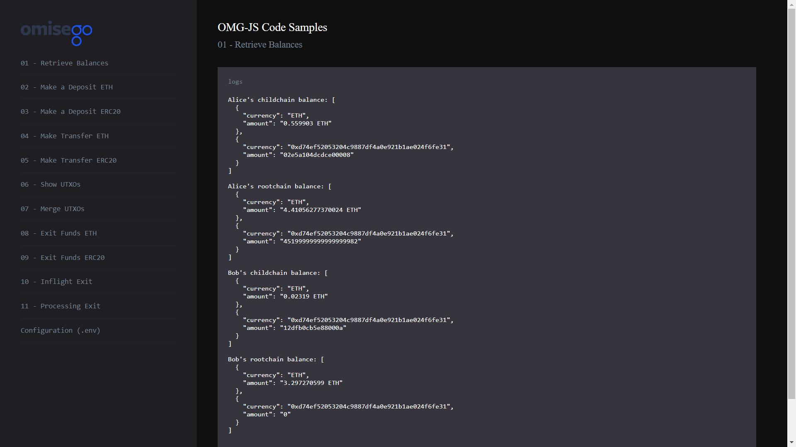

# Retrieve root chain and child chain balances

_By the end of this tutorial you should know how to retrieve root chain and child chain balances for Alice and Bob._

## Intro

The example uses `getBalance` function provided by [web3.js](https://github.com/ethereum/web3.js) to retrieve the balance from the root chain (Ethereum network), and `getBalance` or `getErc20Balance` functions provided by [omg-js](https://github.com/omgnetwork/omg-js) to retrieve balance from the child chain (OMG Network).

## Steps

1. App setup
2. Logging chil dchain balances for Alice
3. Logging root chain balances for Alice
4. Logging child chain balances for Bob
5. Logging root chain balances for Bob

### 1. App setup

You can find the full Javascript segment of this tutorial in [balances.js](./balances.js). The first lines define dependent libraries, packages, and configs:

```
import Web3 from "web3";
import { ChildChain, OmgUtil } from "@omisego/omg-js";
import config from "../../config";

const web3 = new Web3(new Web3.providers.HttpProvider(config.eth_node), null, {
  transactionConfirmationBlocks: 1,
});
const childChain = new ChildChain({
  watcherUrl: config.watcher_url,
  watcherProxyUrl: config.watcher_proxy_url,
  plasmaContractAddress: config.plasmaframework_contract_address,
});
```

### 2. Logging child chain balances for Alice

```
// child chain balances for Alice
const alicesBalanceArray = await childChain.getBalance(aliceAddress);
const aliceChildchainBalance = alicesBalanceArray.map((i) => {
  return {
    currency:
      i.currency === OmgUtil.transaction.ETH_CURRENCY ? "ETH" : i.currency,
    amount: web3.utils.fromWei(String(i.amount)),
  };
});
console.log(
  `Alice's child chain balance: ${JSON.stringify(
    aliceChildchainBalance,
    null,
    2
  )}`
);
```

Example output:

```
Alice's child chain balance: [
  {
    "currency": "ETH",
    "amount": "0.576903"
  },
  {
    "currency": "0xd74ef52053204c9887df4a0e921b1ae024f6fe31",
    "amount": "53.440000000000000008"
  }
]
```

### 3. Logging root chain balances for Alice

```
// ETH root chain balance for Alice
const aliceRootchainBalance = await web3.eth.getBalance(aliceAddress);
const aliceRootchainBalances = [
  {
    currency: "ETH",
    amount: web3.utils.fromWei(String(aliceRootchainBalance), "ether"),
  },
];

// ERC20 root chain balance for Alice
if (erc20ContractAddress) {
  const aliceRootchainERC20Balance = await OmgUtil.getErc20Balance({
    web3,
    address: aliceAddress,
    erc20Address: erc20ContractAddress,
  });
  aliceRootchainBalances.push({
    currency: erc20ContractAddress,
    amount: web3.utils.fromWei(String(aliceRootchainERC20Balance)),
  });
}

console.log(
  `Alice's root chain balance: ${JSON.stringify(
    aliceRootchainBalances,
    null,
    2
  )}`
);
```

Example output:

```
Alice's root chain balance: [
  {
    "currency": "ETH",
    "amount": "4.39194044450024"
  },
  {
    "currency": "0xd74ef52053204c9887df4a0e921b1ae024f6fe31",
    "amount": "45.199999999999999982"
  }
]
```

### 4. Logging child chain balances for Bob

```
// child chain balances for Bob
const bobsBalanceArray = await childChain.getBalance(bobAddress);
const bobChildchainBalance = bobsBalanceArray.map((i) => {
  return {
    currency:
      i.currency === OmgUtil.transaction.ETH_CURRENCY ? "ETH" : i.currency,
    amount: web3.utils.fromWei(String(i.amount)),
  };
});
console.log(
  `Bob's child chain balance: ${JSON.stringify(bobChildchainBalance, null, 2)}`
);
```

Example output:

```
Bob's child chain balance: [
  {
    "currency": "ETH",
    "amount": "0.02319"
  },
  {
    "currency": "0xd74ef52053204c9887df4a0e921b1ae024f6fe31",
    "amount": "1.36000000000000001"
  }
]
```

### 5. Logging root chain balances for Bob

```
// ETH rootchain balance for Bob
const bobRootchainBalance = await web3.eth.getBalance(bobAddress);
const bobRootchainBalances = [
  {
    currency: "ETH",
    amount: web3.utils.fromWei(String(bobRootchainBalance), "ether"),
  },
];

// ERC20 rootchain balance for Bob
if (erc20ContractAddress) {
  const bobRootchainERC20Balance = await OmgUtil.getErc20Balance({
    web3,
    address: bobAddress,
    erc20Address: erc20ContractAddress,
  });
  bobRootchainBalances.push({
    currency: erc20ContractAddress,
    amount: web3.utils.fromWei(String(bobRootchainERC20Balance)),
  });
}
console.log(
  `Bob's root chain balance: ${JSON.stringify(bobRootchainBalances, null, 2)}`
);

```

Example outputs:

```
Bob's root chain balance: [
  {
    "currency": "ETH",
    "amount": "3.297270599"
  },
  {
    "currency": "0xd74ef52053204c9887df4a0e921b1ae024f6fe31",
    "amount": "0"
  }
]
```

## Running the sample

1. Enter the `omg-js` folder if you're in the root `omg-samples` repository:

```
cd omg-js
```

2. Install dependencies:

```
npm install
```

3. Create `.env` file, modify configurations with required values (look at [.env.example](../../.env.example) or [README](../../README.md) of the `omg-js` repo for details).

4. Run the app:

```
npm run start
```

5. Open your browser at [http://localhost:3000](http://localhost:3000).

6. Select `Retrieve Balances` sample on the left side, observe the logs on the right:

