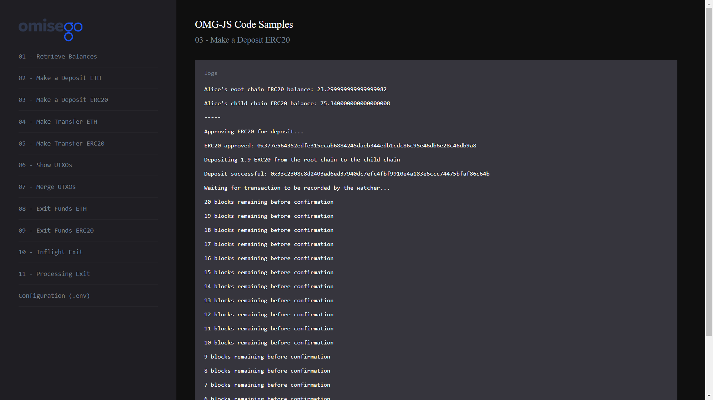

# Deposit ERC20 tokens to the OMG Network

_By the end of this tutorial you should know how to deposit ERC20 tokens to the root chain Plasma smart contract for subsequent use on the OMG network._

## Intro

The example uses `deposit` and `approveToken` functions provided by the `omg-js` library to deposit ERC20 tokens to the root chain smart contract and subsequently to the child chain. The overall process for depositing ERC20 tokens is similar to depositing ETH. If you need more detailed sample, please refer to [Make an ETH Deposit](../02-deposit-eth/README.md).

## Prerequisites

- Any amount of ERC20 tokens in Alice's Web3 wallet. If you're using pre-defined `.env` configurations for Alice and Bob, the wallet should contain some test tokens. Otherwise, you can send 0 Ropsten ETH to several projects, most of them will send you back a few test tokens. For searching smart contracts` addresses, use [Etherscan Token Tracker](https://etherscan.io/tokens) tool.

## Steps

1. App setup
2. Logging root chain and child chain ERC20 balances for Alice
3. Approving ERC20 token for deposit
4. Depositing ERC20 tokens from the root chain to the child chain
5. Recording transaction by the Watcher

### 1. App setup

You can find the full Javascript segment of this tutorial in [deposit-erc20.js](./deposit-erc20.js). The first lines define dependent libraries, set up configs for child chain and root chain, define wallet's data to be used during the sample.

```
import BigNumber from "bn.js";
import Web3 from "web3";
import { ChildChain, RootChain, OmgUtil } from "@omisego/omg-js";
import wait from "../helpers/wait.js";
import config from "../../config.js";

const web3 = new Web3(new Web3.providers.HttpProvider(config.eth_node), null, {
  transactionConfirmationBlocks: 1,
});
const rootChain = new RootChain({
  web3,
  plasmaContractAddress: config.plasmaframework_contract_address,
});
const childChain = new ChildChain({
  watcherUrl: config.watcher_url,
  plasmaContractAddress: config.plasmaframework_contract_address,
});

const aliceAddress = config.alice_eth_address;
const alicePrivateKey = config.alice_eth_address_private_key;
const depositAmount = new BigNumber(
  web3.utils.toWei(config.alice_erc20_deposit_amount, "ether")
);
```

### 2. Logging root chain and child chain ETH balances for Alice

Logging balances helps to see the changes in the wallet before and after depositing funds. For more detailed example, please refer to [Retrieve Balances](../01-balances/README.md) sample.

```
async function logBalances() {
  const rootchainERC20Balance = await OmgUtil.getErc20Balance({
    web3,
    address: aliceAddress,
    erc20Address: config.erc20_contract_address,
  });
  const childchainBalanceArray = await childChain.getBalance(aliceAddress);
  const erc20Object = childchainBalanceArray.find(
    (i) =>
      i.currency.toLowerCase() === config.erc20_contract_address.toLowerCase()
  );
  const childchainERC20Balance = erc20Object ? erc20Object.amount : 0;

  console.log(
    `Alice's root chain ERC20 balance: ${web3.utils.fromWei(
      rootchainERC20Balance.toString(),
      "ether"
    )}`
  );
  console.log(
    `Alice's child chain ERC20 balance: ${web3.utils.fromWei(
      childchainERC20Balance.toString(),
      "ether"
    )}`
  );
}
```

Example output:

```
Alice's root chain ERC20 balance: 25.199999999999999982

Alice's child chain ERC20 balance: 73.440000000000000008
```

### 3. Approving ERC20 token for deposit

Depositing ERC20 tokens requires approval of the corresponding `Vault` contract. You can deposit tokens only after this process is finished.

```
console.log("Approving ERC20 for deposit...");
const approveRes = await rootChain.approveToken({
  erc20Address: config.erc20_contract_address,
  amount: depositAmount,
  txOptions: {
    from: aliceAddress,
    privateKey: alicePrivateKey,
    gas: 6000000,
  },
});
console.log("ERC20 approved: " + String(approveRes.transactionHash));
```

Example output:

```
Approving ERC20 for deposit...

ERC20 approved: 0x19b0dd9327587e223c72d374db35cf641eb129f3ee5e2a5edb57f77c43d9ba87
```

### 4. Depositing ERC20 tokens from the root chain to the child chain

A typical deposit uses the `deposit` function provided by the `Rootchain` module of the `omg-js` library.

Note, each ERC20 token has a certain smart contract address. In this sample you can observe a deposit of `EUR` token defined by `0xd74ef52053204c9887df4a0e921b1ae024f6fe31` smart contract.

```
console.log(
  `Depositing ${web3.utils.fromWei(
    depositAmount.toString(),
    "ether"
  )} ERC20 from the root chain to the child chain`
);
const transactionReceipt = await rootChain.deposit({
  amount: depositAmount,
  currency: config.erc20_contract_address,
  txOptions: {
    from: aliceAddress,
    privateKey: alicePrivateKey,
    gas: 6000000,
  },
});
console.log("Deposit successful: " + String(transactionReceipt.transactionHash));
```

Example output:

```
Depositing 1.9 ERC20 from the root chain to the child chain

Deposit successful: 0xbcb340775157d5f0d21ae8bd5b13d51b7dd62bf79737f8ceea1f46bf33ae4fbe
```

### 5. Recording transaction by the Watcher

Watcher is a service that ensures the validity of all deposits, transfers and exits on the OMG Network. It is advisable to run your own Watcher if you have enough technical expertise to set it up.

The current sample shows that `1.9 ERC20 tokens` were sent to the root chain smart contract: the original amount was `25.199999999999999982`, the amount after is `23.299999999999999982`.

You will have to wait for some time until the transaction confirms on the OMG Network to be able to use the funds. The current number of required confirmations for deposits is 10. At the end of this period, you will see the updated ERC20 balance of Alice's address on the child chain: the original amount was `73.440000000000000008`, the amount after is `75.340000000000000008`.

```
console.log("Waiting for transaction to be recorded by the watcher...");
await OmgUtil.waitForRootchainTransaction({
  web3,
  transactionHash: transactionReceipt.transactionHash,
  checkIntervalMs: config.millis_to_wait_for_next_block,
  blocksToWait: config.blocks_to_wait_for_txn,
  onCountdown: (remaining) =>
    console.log(`${remaining} blocks remaining before confirmation`),
});

await wait.wait(5000);
console.log("-----");
await logBalances();
```

Example output:

```
Waiting for a transaction to be recorded by the watcher...

12 blocks remaining before confirmation

11 blocks remaining before confirmation

10 blocks remaining before confirmation

9 blocks remaining before confirmation

8 blocks remaining before confirmation

7 blocks remaining before confirmation

6 blocks remaining before confirmation

4 blocks remaining before confirmation

3 blocks remaining before confirmation

2 blocks remaining before confirmation

1 blocks remaining before confirmation

0 blocks remaining before confirmation

Waiting for 0.08335000000000001 min...

-----

Alice's root chain ERC20 balance: 23.299999999999999982

Alice's child chain ERC20 balance: 75.340000000000000008
```

## Running the sample

1. Enter the `omg-js` folder if you're in the root `omg-samples` repository:

```
cd omg-js
```

2. Install dependencies:

```
npm install
```

3. Create `.env` file, modify configurations with required values (look at [.env.example](../../.env.example) or [README](../../README.md) of the `omg-js` repo for details).

4. Run the app:

```
npm run start
```

5. Open your browser at [http://localhost:3000](http://localhost:3000).

6. Select `Make an ERC20 Deposit` sample on the left side, observe the logs on the right:

