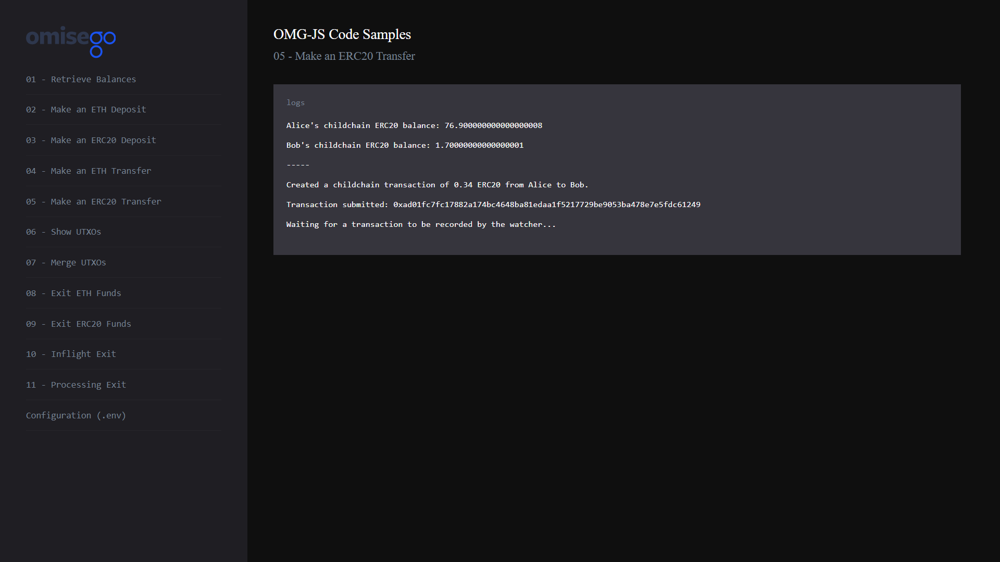

# Making an ERC20 transfer on the OMG Network

_By the end of this tutorial you should know how to make an ERC20 transfer on the OMG network._

## Intro

The example uses `createTransaction` function provided by the `Childchain` module of the `omg-js` library to create a payment transaction on the OMG Network.

## Prerequisites

- Any amount of ETH in Alice's OMG Network wallet. If you're using pre-defined `.env` configurations for Alice and Bob, the wallet should contain test ETH. Otherwise, top it up with [Ropsten faucet](https://faucet.metamask.io/) (for testnet) or actual ETH (for mainnet).

## Steps

1. App setup
2. Logging child chain ERC20 balances for Alice and Bob
3. Creating a payment transaction
4. Signing, building and submitting a transaction
5. Recording transaction by the Watcher

### 1. App setup

You can find the full Javascript segment of this tutorial in [transaction-erc20.js](./transaction-erc20.js). The first lines define dependent libraries, set up configs for child chain and root chain, define wallet's data to be used during the sample.

```
import { ChildChain, OmgUtil } from "@omisego/omg-js";
import BigNumber from "bn.js";
import Web3 from "web3";
import wait from "../helpers/wait.js";
import config from "../../config.js";

const rootChainPlasmaContractAddress = config.plasmaframework_contract_address;
const web3 = new Web3(new Web3.providers.HttpProvider(config.eth_node), null, {
  transactionConfirmationBlocks: 1,
});
const childChain = new ChildChain({
  watcherUrl: config.watcher_url,
  watcherProxyUrl: config.watcher_proxy_url,
  plasmaContractAddress: config.plasmaframework_contract_address,
});

const aliceAddress = config.alice_eth_address;
const alicePrivateKey = config.alice_eth_address_private_key;
const bobAddress = config.bob_eth_address;
const transferAmount = new BigNumber(
  web3.utils.toWei(config.alice_erc20_transfer_amount, "ether")
);
```

### 2. Logging child chain ERC20 balances for Alice and Bob

Logging balances helps to see the changes in the wallets before and after making any transaction. For more detailed example, please refer to [Retrieve Balances](../01-balances/README.md).

```
async function logBalances() {
  const alicesBalanceArray = await childChain.getBalance(aliceAddress);
  const aliceErc20Object = alicesBalanceArray.find(
    (i) =>
      i.currency.toLowerCase() === config.erc20_contract_address.toLowerCase()
  );
  const alicesChildchainERC20Balance = aliceErc20Object
    ? aliceErc20Object.amount
    : 0;

  const bobsBalanceArray = await childChain.getBalance(bobAddress);
  const bobErc20Object = bobsBalanceArray.find(
    (i) =>
      i.currency.toLowerCase() === config.erc20_contract_address.toLowerCase()
  );
  const bobsChildchainERC20Balance = bobErc20Object ? bobErc20Object.amount : 0;

  console.log(
    `Alice's childchain ERC20 balance: ${web3.utils.fromWei(
      alicesChildchainERC20Balance.toString(),
      "ether"
    )}`
  );
  console.log(
    `Bob's childchain ERC20 balance: ${web3.utils.fromWei(
      bobsChildchainERC20Balance.toString(),
      "ether"
    )}`
  );
  return { bobERC20Balance: bobsChildchainERC20Balance };
}
```

Example output:

```
Alice's childchain ERC20 balance: 77.240000000000000008
 
Bob's childchain ERC20 balance: 1.36000000000000001
```

### 3. Creating a payment transaction

The creation of a transaction starts with `createTransaction` function provided by the `Childchain` module of the `omg-js` library.

```
const payments = [
  {
    owner: bobAddress,
    currency: config.erc20_contract_address,
    amount: transferAmount,
  },
];
const fee = {
  currency: OmgUtil.transaction.ETH_CURRENCY,
};

const createdTxn = await childChain.createTransaction({
  owner: aliceAddress,
  payments,
  fee,
  metadata: "omg",
});
console.log(
  `Created a childchain transaction of ${web3.utils.fromWei(
    transferAmount.toString(),
    "ether"
  )} ERC20 from Alice to Bob.`
);
```

Example output:

```
Created a childchain transaction of 0.34 ERC20 from Alice to Bob.
```

### 4. Signing, building and submitting a transaction

```
// type/sign/build/submit
const typedData = OmgUtil.transaction.getTypedData(
  createdTxn.transactions[0],
  rootChainPlasmaContractAddress
);
const privateKeys = new Array(createdTxn.transactions[0].inputs.length).fill(
  alicePrivateKey
);
const signatures = childChain.signTransaction(typedData, privateKeys);
const signedTxn = childChain.buildSignedTransaction(typedData, signatures);
const receipt = await childChain.submitTransaction(signedTxn);
console.log("Transaction submitted: " + receipt.txhash);
```

Example output:

```
Signing transaction...

Building transaction...

Submitting transaction...

Transaction submitted: 0x6840c4d5d365badf18dbfa490a39be0dd047368a78ea9e1bf71557a8a7aa2ab1
```

### 5. Recording transaction by the Watcher

```
console.log("Waiting for a transaction to be recorded by the Watcher...");
const expectedAmount = Number(transferAmount) + Number(bobERC20Balance);

await wait.waitForBalance(
  childChain,
  bobAddress,
  expectedAmount,
  config.erc20_contract_address
);

console.log("-----");
await logBalances();
```

Example output:

```
Waiting for a transaction to be recorded by the watcher...

Waiting for balance: 1

Waiting for balance: 2

Waiting for balance: 3

...

Waiting for balance: 12
-----

Alice's child chain ERC20 balance: ‭76.900000000000000008

Bob's child chain ERC20 balance: 1.70000000000000001
```

## Running the sample

1. Enter the `omg-js` folder if you're in the root `omg-samples` repository:

```
cd omg-js
```

2. Install dependencies:

```
npm install
```

3. Create `.env` file, modify configurations with required values (look at [.env.example](../../.env.example) or [README](../../README.md) of the `omg-js` repo for details).

4. Run the app:

```
npm run start
```

5. Open your browser at [http://localhost:3000](http://localhost:3000).

6. Select `Make an ERC20 Transaction` sample on the left side, observe the logs on the right:

