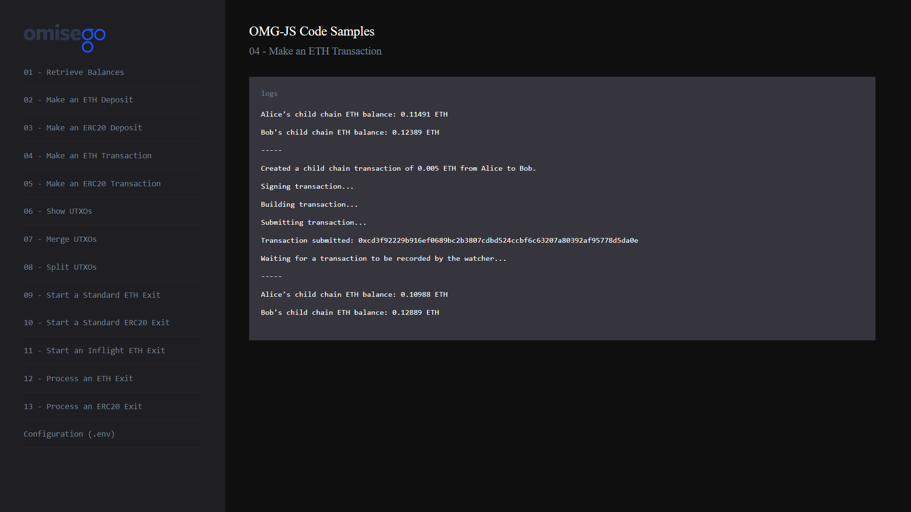

# Making ETH transfer on the OMG Network

_By the end of this tutorial you should know how to make ETH transfer on the OMG network._

## Intro

The example uses `createTransaction` function provided by the `Childchain` module of the `omg-js` library.

## Prerequisites

- Any amount of ETH in Alice's OMG Network wallet. If you're using pre-defined `.env` configurations for Alice and Bob, the wallet should contain test ETH. Otherwise, top it up with [Ropsten faucet](https://faucet.metamask.io/) (for testnet) or actual ETH (for mainnet).

## Steps

1. App setup
2. Logging child chain ETH balances for Alice and Bob
3. Creating a payment transaction
4. Signing, building and submitting a transaction
5. Recording transaction by the Watcher

### 1. App setup

You can find the full Javascript segment of this tutorial in [transaction-eth.js](./transaction-eth.js). The first lines define dependent libraries, set up configs for child chain and root chain, define wallet's data to be used during the sample.

```
import BigNumber from "bn.js";
import Web3 from "web3";
import { ChildChain, OmgUtil } from "@omisego/omg-js";
import wait from "../helpers/wait.js";
import config from "../../config.js";

const web3 = new Web3(new Web3.providers.HttpProvider(config.eth_node), null, {
  transactionConfirmationBlocks: 1,
});
const childChain = new ChildChain({
  watcherUrl: config.watcher_url,
  watcherProxyUrl: config.watcher_proxy_url,
  plasmaContractAddress: config.plasmaframework_contract_address,
});

const rootChainPlasmaContractAddress = config.plasmaframework_contract_address;
const aliceAddress = config.alice_eth_address;
const alicePrivateKey = config.alice_eth_address_private_key;
const bobAddress = config.bob_eth_address;
```

### 2. Logging child chain ETH balances for Alice and Bob

Logging balances helps to see the changes in the wallets before and after making any transaction. For more detailed example, please refer to [Retrieve Balances](../01-balances/README.md).

```
async function logBalances() {
  const alicesBalanceArray = await childChain.getBalance(aliceAddress);
  const alicesEthObject = alicesBalanceArray.find(
    (i) => i.currency === OmgUtil.transaction.ETH_CURRENCY
  );
  const alicesChildchainETHBalance = alicesEthObject
    ? `${web3.utils.fromWei(String(alicesEthObject.amount))} ETH`
    : "0 ETH";

  const bobsBalanceArray = await childChain.getBalance(bobAddress);
  const bobsEthObject = bobsBalanceArray.find(
    (i) => i.currency === OmgUtil.transaction.ETH_CURRENCY
  );
  const bobsChildchainETHBalance = bobsEthObject
    ? `${web3.utils.fromWei(String(bobsEthObject.amount))} ETH`
    : "0 ETH";

  console.log(`Alice's childchain ETH balance: ${alicesChildchainETHBalance}`);
  console.log(`Bob's childchain ETH balance: ${bobsChildchainETHBalance}`);
  return { bobETHBalance: bobsEthObject ? bobsEthObject.amount : 0 };
}
```

Example output:

```
Alice's child chain ETH balance: 0.686843 ETH

Bob's child chain ETH balance: 0.03319 ETH

```

### 3. Creating a payment transaction

The creation of a transaction starts with `createTransaction` function provided by the `Childchain` module of the `omg-js` library.

```
const transferAmount = new BigNumber(
  web3.utils.toWei(config.alice_eth_transfer_amount, "ether")
);

const payments = [
  {
    owner: bobAddress,
    currency: OmgUtil.transaction.ETH_CURRENCY,
    amount: Number(transferAmount),
  },
];
console.log(payments);

const fee = {
  currency: OmgUtil.transaction.ETH_CURRENCY,
};

const createdTxn = await childChain.createTransaction({
  owner: aliceAddress,
  payments,
  fee,
  metadata: "hello",
});

console.log(
  `Created a childchain transaction of ${web3.utils.fromWei(
    payments[0].amount.toString(),
    "ether"
  )} ETH from Alice to Bob.`
);
```

Example output:

```
Created a child chain transaction of 0.005 ETH from Alice to Bob.
```

### 4. Signing, building and submitting a transaction

Each transaction should be signed by the owner of funds (UTXOs). The payment transaction should have a specific format and encoded with [RLP encoding](https://github.com/ethereum/wiki/wiki/RLP).

```
// sign/build/submit
const typedData = OmgUtil.transaction.getTypedData(
  createdTxn.transactions[0],
  rootChainPlasmaContractAddress
);
const privateKeys = new Array(createdTxn.transactions[0].inputs.length).fill(
  alicePrivateKey
);
const signatures = childChain.signTransaction(typedData, privateKeys);
const signedTxn = childChain.buildSignedTransaction(typedData, signatures);
const receipt = await childChain.submitTransaction(signedTxn);
console.log("Transaction submitted: " + receipt.txhash);
```

Example output:

```
Signing transaction...

Building transaction...

Submitting transaction...

Transaction submitted: 0x97107fdb1a4c9201411bc56bde8e83500d2a76f1ad99f9e7d6207e56872b9c6a
```

### 5. Recording transaction by the Watcher

```
// wait for transaction to be recorded by the watcher
console.log("Waiting for transaction to be recorded by the Watcher...");
const expectedAmount = Number(transferAmount) + Number(bobETHBalance);

await wait.waitForBalance(
  childChain,
  bobAddress,
  expectedAmount,
  OmgUtil.transaction.ETH_CURRENCY
);

console.log("-----");
await logBalances();
```

Example output:

```
Waiting for a transaction to be recorded by the watcher...

Waiting for balance: 1

Waiting for balance: 2

Waiting for balance: 3

...

Waiting for balance: 12
-----

Alice's child chain ETH balance: 0.681813 ETH

Bob's child chain ETH balance: 0.03819 ETH
```

## Running the sample

1. Enter the `omg-js` folder if you're in the root `omg-samples` repository:

```
cd omg-js
```

2. Install dependencies:

```
npm install
```

3. Create `.env` file, modify configurations with required values (look at [.env.example](../../.env.example) or [README](../../README.md) of the `omg-js` repo for details).

4. Run the app:

```
npm run start
```

5. Open your browser at [http://localhost:3000](http://localhost:3000).

6. Select `Make an ETH Transaction` sample on the left side, observe the logs on the right:

