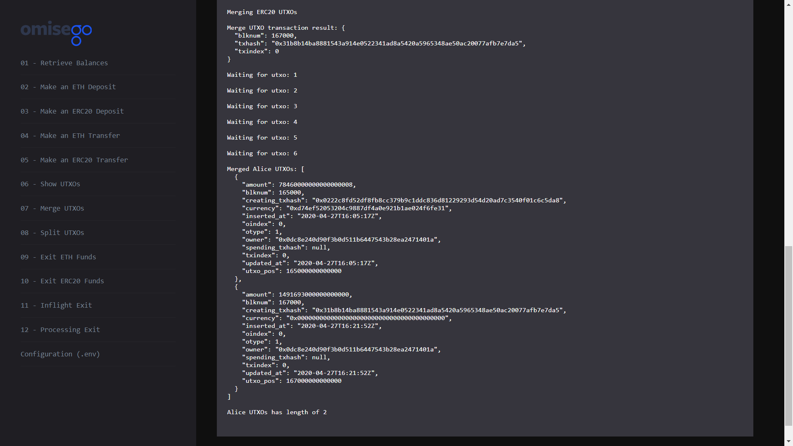

# Merge ETH and ERC20 UTXOs for Alice

_By the end of this tutorial you should know how to merge Ethereum and ERC20 UTXOs for Alice wallet._

## Intro

The example uses the `mergeUtxos` function provided by the `Childchain` module of the `omg-js` library to merge a list of unspent outputs (UTXOs) for a provided wallet.

## Prerequisites

- At least 2 UTXOs (ETH or ERC20) in Alice's OMG Network wallet. For creating a new UTXO, you can [make a deposit](../02-deposit-eth/README.md), [receive a transaction](../03-transaction-eth/README.md), or [split an existing UTXO](../04-utxo-split/README.md).

## Steps

1. App setup
2. Logging UTXOs for Alice
3. Merging ETH UTXOs for Alice

### 1. App setup

You can find the full Javascript segment of this tutorial in [utxo-merge.js](./utxo-merge.js). The first lines define dependent libraries, set up configs for child chain.

```
import { ChildChain, OmgUtil } from "@omisego/omg-js";
import JSONBigNumber from "omg-json-bigint";
import wait from "../helpers/wait.js";
import config from "../../config.js";

const childChain = new ChildChain({
  watcherUrl: config.watcher_url,
  watcherProxyUrl: config.watcher_proxy_url,
  plasmaContractAddress: config.plasmaframework_contract_address,
});

```

### 2. Logging UTXOs for Alice

Logging UTXOs helps to understand how many funds can be merged. For performing this operation, use `getUtxos` function by the `Childchain` module provided by the `omg-js` library.

```
async function showUtxo() {
  const aliceUtxosAll = await childChain.getUtxos(aliceAddress);
  const aliceEthUtxos = aliceUtxosAll.filter(
    (u) => u.currency === OmgUtil.transaction.ETH_CURRENCY
  );
  const aliceErc20Utxos = aliceUtxosAll.filter(
    (u) =>
      u.currency.toLowerCase() === config.erc20_contract_address.toLowerCase()
  );

  console.log(
    `Alice has ${aliceEthUtxos.length} ETH UTXOs and ${aliceErc20Utxos.length} ERC20 UTXOs`
  );

  console.log(
    `Alice ETH UTXOs: ${JSONBigNumber.stringify(aliceEthUtxos, undefined, 2)}`
  );
  console.log(
    `Alice ERC20 UTXOs: ${JSONBigNumber.stringify(
      aliceErc20Utxos,
      undefined,
      2
    )}`
  );
}
```

Example output:

```
Alice has 3 ETH UTXOs and 1 ERC20 UTXOs

Alice ETH UTXOs: [
  {
    "amount": 761693000000000000,
    "blknum": 162000,
    "creating_txhash": "0xc5e01e0ce1578f816d074ec3c190f85df32a9634265b540882eeeee316c08a51",
    "currency": "0x0000000000000000000000000000000000000000",
    "inserted_at": "2020-04-27T13:50:17Z",
    "oindex": 0,
    "otype": 1,
    "owner": "0x0dc8e240d90f3b0d511b6447543b28ea2471401a",
    "spending_txhash": null,
    "txindex": 0,
    "updated_at": "2020-04-27T13:50:17Z",
    "utxo_pos": 162000000000000
  },
  {
    "amount": 700000000000000000,
    "blknum": 166001,
    "creating_txhash": null,
    "currency": "0x0000000000000000000000000000000000000000",
    "inserted_at": "2020-04-27T16:12:33Z",
    "oindex": 0,
    "otype": 1,
    "owner": "0x0dc8e240d90f3b0d511b6447543b28ea2471401a",
    "spending_txhash": null,
    "txindex": 0,
    "updated_at": "2020-04-27T16:12:33Z",
    "utxo_pos": 166001000000000
  },
  {
    "amount": 30000000000000000,
    "blknum": 166002,
    "creating_txhash": null,
    "currency": "0x0000000000000000000000000000000000000000",
    "inserted_at": "2020-04-27T16:15:23Z",
    "oindex": 0,
    "otype": 1,
    "owner": "0x0dc8e240d90f3b0d511b6447543b28ea2471401a",
    "spending_txhash": null,
    "txindex": 0,
    "updated_at": "2020-04-27T16:15:23Z",
    "utxo_pos": 166002000000000
  }
]

Alice ERC20 UTXOs: [
  {
    "amount": 78460000000000000008,
    "blknum": 165000,
    "creating_txhash": "0x0222c8fd52df8fb8cc379b9c1ddc836d81229293d54d20ad7c3540f01c6c5da8",
    "currency": "0xd74ef52053204c9887df4a0e921b1ae024f6fe31",
    "inserted_at": "2020-04-27T16:05:17Z",
    "oindex": 0,
    "otype": 1,
    "owner": "0x0dc8e240d90f3b0d511b6447543b28ea2471401a",
    "spending_txhash": null,
    "txindex": 0,
    "updated_at": "2020-04-27T16:05:17Z",
    "utxo_pos": 165000000000000
  }
]
```

### 3. Merging ETH UTXOs for Alice

The sample demonstrates how to merge ETH UTXOs. If you want to merge ERC20 UTXOs, change an array that will be used for merging from `aliceEthUtxos` to `aliceErc20Utxos`. For example:

```
const utxosToMerge = aliceErc20Utxos.slice(0, 4);
const utxo = await childChain.mergeUtxos({
   utxos: utxosToMerge,
   privateKey: alicePrivateKey,
});
```

```
if (aliceUtxosAll.length > 1) {
  console.log("Merging ERC20 UTXOs");
  const utxosToMerge = aliceEthUtxos.slice(0, 4);
  const utxo = await childChain.mergeUtxos({
    utxos: utxosToMerge,
    privateKey: alicePrivateKey,
  });

  console.log(
    "Merge UTXO transaction result: " + JSON.stringify(utxo, undefined, 2)
  );
  await wait.waitForUtxo(childChain, aliceAddress, {
    ...utxo,
    oindex: 0,
  });

  const newAliceUtxos = await childChain.getUtxos(aliceAddress);
  console.log(
    `Merged Alice UTXOs: ${JSONBigNumber.stringify(
      newAliceUtxos,
      undefined,
      2
    )}`
  );
  console.log(`Alice UTXOs has length of ${newAliceUtxos.length}`);
} else {
  console.log(
    "You have less than two UTXOs. The minimum number to merge is 2. Make a deposit and get back."
  );
}
```

Example output:

```
Merging ERC20 UTXOs...

Waiting for utxo: 1

Waiting for utxo: 2

Waiting for utxo: 3

Waiting for utxo: 4

Waiting for utxo: 5

Waiting for utxo: 6

Merged Alice UTXOs: [
  {
    "amount": 78460000000000000008,
    "blknum": 165000,
    "creating_txhash": "0x0222c8fd52df8fb8cc379b9c1ddc836d81229293d54d20ad7c3540f01c6c5da8",
    "currency": "0xd74ef52053204c9887df4a0e921b1ae024f6fe31",
    "inserted_at": "2020-04-27T16:05:17Z",
    "oindex": 0,
    "otype": 1,
    "owner": "0x0dc8e240d90f3b0d511b6447543b28ea2471401a",
    "spending_txhash": null,
    "txindex": 0,
    "updated_at": "2020-04-27T16:05:17Z",
    "utxo_pos": 165000000000000
  },
  {
    "amount": 1491693000000000000,
    "blknum": 167000,
    "creating_txhash": "0x31b8b14ba8881543a914e0522341ad8a5420a5965348ae50ac20077afb7e7da5",
    "currency": "0x0000000000000000000000000000000000000000",
    "inserted_at": "2020-04-27T16:21:52Z",
    "oindex": 0,
    "otype": 1,
    "owner": "0x0dc8e240d90f3b0d511b6447543b28ea2471401a",
    "spending_txhash": null,
    "txindex": 0,
    "updated_at": "2020-04-27T16:21:52Z",
    "utxo_pos": 167000000000000
  }
]

Alice UTXOs has length of 2
```

## Running the sample

1. Enter the `omg-js` folder if you're in the root `omg-samples` repository:

```
cd omg-js
```

2. Install dependencies:

```
npm install
```

3. Create `.env` file, modify configurations with required values (look at [.env.example](../../.env.example) or [README](../../README.md) of the `omg-js` repo for details).

4. Run the app:

```
npm run start
```

5. Open your browser at [http://localhost:3000](http://localhost:3000).

6. Select `Merge UTXOs` sample on the left side, observe the logs on the right:


