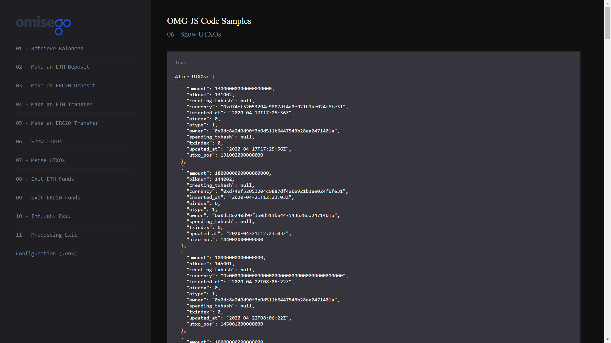

# Show UTXOs for Alice and Bob

_By the end of this tutorial you should know how to show UTXOs for Alice and Bob wallets._

## Intro

The example uses `getUtxos` function provided by the `Childchain` module of the `omg-js` library to show a list of unspent outputs (UTXOs) for Alice and Bob wallets.

## Prerequisites

- Any number of UTXOs in Alice's and Bob's OMG Network wallets. For creating a new UTXO, you can [make a deposit](../02-deposit-eth/README.md), [receive a transaction](../03-transaction-eth/README.md), or [split an existing UTXO](../04-utxo-split/README.md).

## Steps

1. App setup
2. Logging UTXOs for Alice and Bob

### 1. App setup

You can find the full Javascript segment of this tutorial in [utxo-show.js](./utxo-show.js). The first lines define dependent libraries, set up configs for child chain, and wallet addresses for Alice and Bob.

```
import { ChildChain, OmgUtil } from "@omisego/omg-js";
import JSONBigNumber from "omg-json-bigint";
import config from "../../config.js";

const childChain = new ChildChain({
  watcherUrl: config.watcher_url,
  watcherProxyUrl: config.watcher_proxy_url,
  plasmaContractAddress: config.plasmaframework_contract_address,
});

const aliceAddress = config.alice_eth_address;
const bobAddress = config.bob_eth_address;
```

### 2. Logging ETH and ERC20 UTXOs for Alice

Logging UTXOs helps to understand how many funds can be withdrawn to the root chain. For performing this operation, use `getUtxos` function by the `Childchain` module provided by the `omg-js` library.

By default, `getUtxos` function returns all UTXOs owned by the address you set as an argument. You may want to filter them by the currency (for working only with ETH UTXOs), or by the ERC20 smart contract address (for working with ERC20 tokens) respectively.

```
const aliceUtxosAll = await childChain.getUtxos(aliceAddress);
const aliceEthUtxos = aliceUtxosAll.filter(
  (u) => u.currency === OmgUtil.transaction.ETH_CURRENCY
);
const aliceErc20Utxos = aliceUtxosAll.filter(
  (u) =>
    u.currency.toLowerCase() === config.erc20_contract_address.toLowerCase()
);

console.log(
  `Alice has ${aliceEthUtxos.length} ETH UTXOs and ${aliceErc20Utxos.length} ERC20 UTXOs`
);

console.log(
  `Alice ETH UTXOs: ${JSONBigNumber.stringify(aliceEthUtxos, undefined, 2)}`
);
console.log(
  `Alice ERC20 UTXOs: ${JSONBigNumber.stringify(aliceErc20Utxos, undefined, 2)}`
);
```

Example output:

```
Alice has 1 ETH UTXOs and 4 ERC20 UTXOs
 
Alice ETH UTXOs: [
  {
    "amount": 761693000000000000,
    "blknum": 162000,
    "creating_txhash": "0xc5e01e0ce1578f816d074ec3c190f85df32a9634265b540882eeeee316c08a51",
    "currency": "0x0000000000000000000000000000000000000000",
    "inserted_at": "2020-04-27T13:50:17Z",
    "oindex": 0,
    "otype": 1,
    "owner": "0x0dc8e240d90f3b0d511b6447543b28ea2471401a",
    "spending_txhash": null,
    "txindex": 0,
    "updated_at": "2020-04-27T13:50:17Z",
    "utxo_pos": 162000000000000
  }
]
 
Alice ERC20 UTXOs: [
  {
    "amount": 1900000000000000000,
    "blknum": 147015,
    "creating_txhash": null,
    "currency": "0xd74ef52053204c9887df4a0e921b1ae024f6fe31",
    "inserted_at": "2020-04-24T18:37:05Z",
    "oindex": 0,
    "otype": 1,
    "owner": "0x0dc8e240d90f3b0d511b6447543b28ea2471401a",
    "spending_txhash": null,
    "txindex": 0,
    "updated_at": "2020-04-24T18:37:05Z",
    "utxo_pos": 147015000000000
  },
  {
    "amount": 37960000000000000008,
    "blknum": 153000,
    "creating_txhash": "0xad01fc7fc17882a174bc4648ba81edaa1f5217729be9053ba478e7e5fdc61249",
    "currency": "0xd74ef52053204c9887df4a0e921b1ae024f6fe31",
    "inserted_at": "2020-04-24T22:35:01Z",
    "oindex": 2,
    "otype": 1,
    "owner": "0x0dc8e240d90f3b0d511b6447543b28ea2471401a",
    "spending_txhash": null,
    "txindex": 0,
    "updated_at": "2020-04-24T22:35:01Z",
    "utxo_pos": 153000000000002
  },
  {
    "amount": 1900000000000000000,
    "blknum": 156002,
    "creating_txhash": null,
    "currency": "0xd74ef52053204c9887df4a0e921b1ae024f6fe31",
    "inserted_at": "2020-04-27T12:49:10Z",
    "oindex": 0,
    "otype": 1,
    "owner": "0x0dc8e240d90f3b0d511b6447543b28ea2471401a",
    "spending_txhash": null,
    "txindex": 0,
    "updated_at": "2020-04-27T12:49:10Z",
    "utxo_pos": 156002000000000
  },
  {
    "amount": 36700000000000000000,
    "blknum": 164000,
    "creating_txhash": "0xc6992ef6a8a9c0c3467ce38f596ff9c29501bd7ad22a16eb372c43f689d6afd1",
    "currency": "0xd74ef52053204c9887df4a0e921b1ae024f6fe31",
    "inserted_at": "2020-04-27T15:01:48Z",
    "oindex": 0,
    "otype": 1,
    "owner": "0x0dc8e240d90f3b0d511b6447543b28ea2471401a",
    "spending_txhash": null,
    "txindex": 0,
    "updated_at": "2020-04-27T15:01:48Z",
    "utxo_pos": 164000000000000
  }
]
```

### 3. Logging ETH and ERC20 UTXOs for Bob

```
const bobUtxosAll = await childChain.getUtxos(bobAddress);
const bobEthUtxos = bobUtxosAll.filter(
  (u) => u.currency === OmgUtil.transaction.ETH_CURRENCY
);
const bobErc20Utxos = bobUtxosAll.filter(
  (u) =>
    u.currency.toLowerCase() === config.erc20_contract_address.toLowerCase()
);

console.log(
  `Bob has ${bobEthUtxos.length} ETH UTXOs and ${aliceErc20Utxos.length} ERC20 UTXOs`
);

console.log(
  `Bob ETH UTXOs: ${JSONBigNumber.stringify(bobEthUtxos, undefined, 2)}`
);
console.log(
  `Bob ERC20 UTXOs: ${JSONBigNumber.stringify(bobErc20Utxos, undefined, 2)}`
);
```

Example output:
```
Bob has 9 ETH UTXOs and 4 ERC20 UTXOs
 
Bob ETH UTXOs: [
  {
    "amount": 1000000000000000,
    "blknum": 123000,
    "creating_txhash": "0xc2fb39f047f428f28d80b5b5a43cdc82f653cab28c84ed147463fc7136f727f4",
    "currency": "0x0000000000000000000000000000000000000000",
    "inserted_at": "2020-04-17T13:39:58Z",
    "oindex": 0,
    "otype": 1,
    "owner": "0x8b63bb2b829813ece5c2f378d47b2862be271c6c",
    "spending_txhash": null,
    "txindex": 0,
    "updated_at": "2020-04-17T13:39:58Z",
    "utxo_pos": 123000000000000
  },
  {
    "amount": 7000000000000000,
    "blknum": 124000,
    "creating_txhash": "0x810dc27fe8b79127246775ddc1a323327034ad07640e48aba69f070dd96e613b",
    "currency": "0x0000000000000000000000000000000000000000",
    "inserted_at": "2020-04-17T14:05:13Z",
    "oindex": 0,
    "otype": 1,
    "owner": "0x8b63bb2b829813ece5c2f378d47b2862be271c6c",
    "spending_txhash": null,
    "txindex": 0,
    "updated_at": "2020-04-17T14:05:13Z",
    "utxo_pos": 124000000000000
  }
  ...
]
 
Bob ERC20 UTXOs: [
  {
    "amount": 5,
    "blknum": 126000,
    "creating_txhash": "0xc4054846f5ab9fcc80f914b12b436f082e571d4fdc2c148d8c593b8b06b2071c",
    "currency": "0xd74ef52053204c9887df4a0e921b1ae024f6fe31",
    "inserted_at": "2020-04-17T16:47:35Z",
    "oindex": 0,
    "otype": 1,
    "owner": "0x8b63bb2b829813ece5c2f378d47b2862be271c6c",
    "spending_txhash": null,
    "txindex": 0,
    "updated_at": "2020-04-17T16:47:35Z",
    "utxo_pos": 126000000000000
  },
  {
    "amount": 5,
    "blknum": 127000,
    "creating_txhash": "0x0a5ed9ad4e7f0f203e9be856f6f57fff4682cd6008ee15311af803a63dd8cd51",
    "currency": "0xd74ef52053204c9887df4a0e921b1ae024f6fe31",
    "inserted_at": "2020-04-17T16:49:20Z",
    "oindex": 0,
    "otype": 1,
    "owner": "0x8b63bb2b829813ece5c2f378d47b2862be271c6c",
    "spending_txhash": null,
    "txindex": 0,
    "updated_at": "2020-04-17T16:49:20Z",
    "utxo_pos": 127000000000000
  }
  ...
]
```

## Running the sample

1. Enter the `omg-js` folder if you're in the root `omg-samples` repository:

```
cd omg-js
```

2. Install dependencies:

```
npm install
```

3. Create `.env` file, modify configurations with required values (look at [.env.example](../../.env.example) or [README](../../README.md) of the `omg-js` repo for details).

4. Run the app:

```
npm run start
```

5. Open your browser at [http://localhost:3000](http://localhost:3000).

6. Select `Show UTXOs` sample on the left side, observe the logs on the right:

