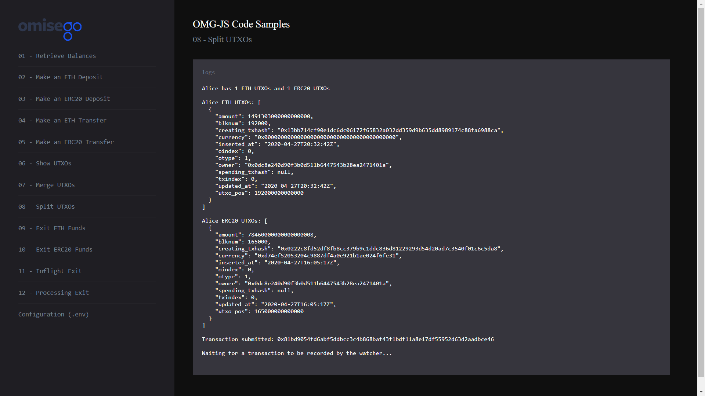

# Split UTXO for Alice

_By the end of this tutorial you should know how to split UTXO by a given wallet address._

## Intro

The example uses `createTransaction` function provided by the `Childchain` module of the `omg-js` library to split the UTXO into multiple UTXOs.

## Prerequisites

- At least one UTXO in Alice's OMG Network wallet. For creating a new UTXO, you can [make a deposit](../02-deposit-eth/README.md) or [receive a transaction](../03-transaction-eth/README.md).

## Steps

1. App setup
2. Logging child chain ETH balances for Alice and Bob
3. Splitting UTXO
4. Signing, building and submitting a transaction
5. Recording transaction by the Watcher

### 1. App setup

You can find the full Javascript segment of this tutorial in [utxo-split.js](./utxo-split.js). The first lines define dependent libraries, set up configs for child chain and wallet's data to be used during the sample.

```
import BigNumber from "bn.js";
import JSONBigNumber from "omg-json-bigint";
import Web3 from "web3";
import { ChildChain, OmgUtil } from "@omisego/omg-js";
import wait from "../helpers/wait.js";
import config from "../../config.js";

const rootChainPlasmaContractAddress = config.plasmaframework_contract_address;
const web3 = new Web3(new Web3.providers.HttpProvider(config.eth_node), null, {
  transactionConfirmationBlocks: 1,
});
const childChain = new ChildChain({
  watcherUrl: config.watcher_url,
  watcherProxyUrl: config.watcher_proxy_url,
  plasmaContractAddress: config.plasmaframework_contract_address,
});

const aliceAddress = config.alice_eth_address;
const alicePrivateKey = config.alice_eth_address_private_key;
```

### 2. Logging UTXOs for Alice

Logging UTXOs helps to see how many UTXOs exist before splitting procedure. For more details, please refer to [Show UTXOs](../04-utxo-show/README.md) sample.

```
async function showUtxo() {
  const aliceUtxosAll = await childChain.getUtxos(aliceAddress);
  const aliceEthUtxos = aliceUtxosAll.filter(
    (u) => u.currency === OmgUtil.transaction.ETH_CURRENCY
  );
  const aliceErc20Utxos = aliceUtxosAll.filter(
    (u) =>
      u.currency.toLowerCase() === config.erc20_contract_address.toLowerCase()
  );

  console.log(
    `Alice has ${aliceEthUtxos.length} ETH UTXOs and ${aliceErc20Utxos.length} ERC20 UTXOs`
  );

  console.log(
    `Alice ETH UTXOs: ${JSONBigNumber.stringify(aliceEthUtxos, undefined, 2)}`
  );
  console.log(
    `Alice ERC20 UTXOs: ${JSONBigNumber.stringify(
      aliceErc20Utxos,
      undefined,
      2
    )}`
  );
}
```

Example output:

```
Alice has 1 ETH UTXOs and 1 ERC20 UTXOs

Alice ETH UTXOs: [
  {
    "amount": 1491543000000000000,
    "blknum": 177000,
    "creating_txhash": "0x6326702903ce08f52d98a5944bb8a153f4b836750f2f3c6679d55e1be1e4dff8",
    "currency": "0x0000000000000000000000000000000000000000",
    "inserted_at": "2020-04-27T17:49:03Z",
    "oindex": 0,
    "otype": 1,
    "owner": "0x0dc8e240d90f3b0d511b6447543b28ea2471401a",
    "spending_txhash": null,
    "txindex": 0,
    "updated_at": "2020-04-27T17:49:03Z",
    "utxo_pos": 177000000000000
  }
]

Alice ERC20 UTXOs: [
  {
    "amount": 78460000000000000008,
    "blknum": 165000,
    "creating_txhash": "0x0222c8fd52df8fb8cc379b9c1ddc836d81229293d54d20ad7c3540f01c6c5da8",
    "currency": "0xd74ef52053204c9887df4a0e921b1ae024f6fe31",
    "inserted_at": "2020-04-27T16:05:17Z",
    "oindex": 0,
    "otype": 1,
    "owner": "0x0dc8e240d90f3b0d511b6447543b28ea2471401a",
    "spending_txhash": null,
    "txindex": 0,
    "updated_at": "2020-04-27T16:05:17Z",
    "utxo_pos": 165000000000000
  }
]

```

### 3. Splitting UTXO

You can split a single UTXO into multiple UTXOs by explicitly specifying an array of objects in the payments argument of `createTransaction` function. The number of objects in this array equals to the number of new UTXOs you want to create. Notice, you can have maximum 4 new UTXOs during this process.

The example shows how to split ETH UTXO. For splitting ERC20 UTXO, change the `currencyToSplit` constant from `OmgUtil.transaction.ETH_CURRENCY` to `config.erc20_contract_address`.

```
const currencyToSplit = config.erc20_contract_address;
```

- In the sample the amount for each UTXO is equal to Alice's transfer amount (`alice_eth_transfer_amount`).
- For creating a transaction, use `createTransaction` function provided by the `Childchain` module of the `omg-js` library.

```
const aliceSplitAmount = new BigNumber(
  web3.utils.toWei(config.alice_eth_transfer_amount, "ether")
);

const payments = [
  {
    owner: aliceAddress,
    currency: OmgUtil.transaction.ETH_CURRENCY,
    amount: Number(aliceSplitAmount),
  },
  {
    owner: aliceAddress,
    currency: OmgUtil.transaction.ETH_CURRENCY,
    amount: Number(aliceSplitAmount),
  },
];

const fee = {
  currency: OmgUtil.transaction.ETH_CURRENCY,
};

const createdTxn = await childChain.createTransaction({
  owner: aliceAddress,
  payments,
  fee,
});
```

### 4. Signing, building and submitting a transaction

Each transaction should be signed by the owner of funds (UTXOs). For more information about each step, see [Make an ETH Transfer](../03-transaction-eth/README.md) sample.

```
const typedData = OmgUtil.transaction.getTypedData(
  createdTxn.transactions[0],
  rootChainPlasmaContractAddress
);
const privateKeys = new Array(createdTxn.transactions[0].inputs.length).fill(
  alicePrivateKey
);
const signatures = childChain.signTransaction(typedData, privateKeys);
const signedTxn = childChain.buildSignedTransaction(typedData, signatures);
const receipt = await childChain.submitTransaction(signedTxn);
console.log("Transaction submitted: " + receipt.txhash);
```

Example output:

```
Signing transaction...

Building transaction...

Submitting transaction...

Transaction submitted: 0x86c624062262cda23d08e4198ab4ccb80b0ce54fd1ffed502755ab64087089cb
```

### 5. Recording transaction by the Watcher

```
console.log("Waiting for a transaction to be recorded by the watcher...");
const expectedAmount = Number(aliceSplitAmount) + Number(aliceEthBalance);

await wait.waitForBalance(
  childChain,
  aliceAddress,
  expectedAmount,
  currencyToSplit
);

console.log("-----");
showUtxo();

```

Example output:

```
Waiting for a transaction to be recorded by the watcher...

-----

Alice ETH UTXOs: [
  {
    "amount": 5000000000000000,
    "blknum": 178000,
    "creating_txhash": "0x86c624062262cda23d08e4198ab4ccb80b0ce54fd1ffed502755ab64087089cb",
    "currency": "0x0000000000000000000000000000000000000000",
    "inserted_at": "2020-04-27T17:50:48Z",
    "oindex": 0,
    "otype": 1,
    "owner": "0x0dc8e240d90f3b0d511b6447543b28ea2471401a",
    "spending_txhash": null,
    "txindex": 0,
    "updated_at": "2020-04-27T17:50:48Z",
    "utxo_pos": 178000000000000
  },
  {
    "amount": 5000000000000000,
    "blknum": 178000,
    "creating_txhash": "0x86c624062262cda23d08e4198ab4ccb80b0ce54fd1ffed502755ab64087089cb",
    "currency": "0x0000000000000000000000000000000000000000",
    "inserted_at": "2020-04-27T17:50:48Z",
    "oindex": 1,
    "otype": 1,
    "owner": "0x0dc8e240d90f3b0d511b6447543b28ea2471401a",
    "spending_txhash": null,
    "txindex": 0,
    "updated_at": "2020-04-27T17:50:48Z",
    "utxo_pos": 178000000000001
  },
  {
    "amount": 1481513000000000000,
    "blknum": 178000,
    "creating_txhash": "0x86c624062262cda23d08e4198ab4ccb80b0ce54fd1ffed502755ab64087089cb",
    "currency": "0x0000000000000000000000000000000000000000",
    "inserted_at": "2020-04-27T17:50:48Z",
    "oindex": 2,
    "otype": 1,
    "owner": "0x0dc8e240d90f3b0d511b6447543b28ea2471401a",
    "spending_txhash": null,
    "txindex": 0,
    "updated_at": "2020-04-27T17:50:48Z",
    "utxo_pos": 178000000000002
  }
]
```

## Running the sample

1. Enter the `omg-js` folder if you're in the root `omg-samples` repository:

```
cd omg-js
```

2. Install dependencies:

```
npm install
```

3. Create `.env` file, modify configurations with required values (look at [.env.example](../../.env.example) or [README](../../README.md) of the `omg-js` repo for details).

4. Run the app:

```
npm run start
```

5. Open your browser at [http://localhost:3000](http://localhost:3000).

6. Select `Make an ETH Transfer` sample on the left side, observe the logs on the right:


