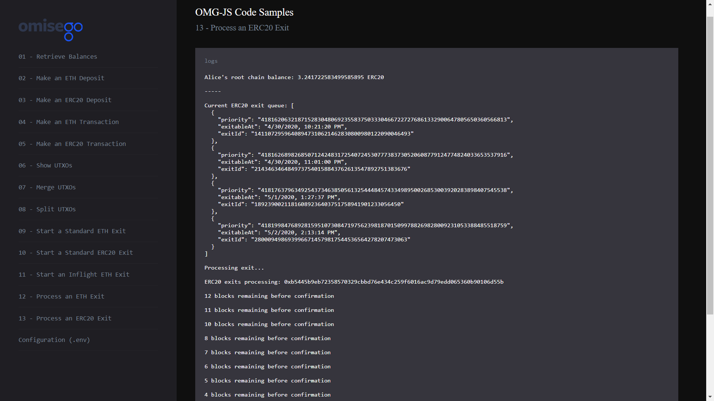

# Process an ERC20 Exit for Alice

_By the end of this tutorial you should know how to process an ERC20 exit for Alice wallet._

## Intro

The example uses the `processExits` function provided by the `Rootchain` module of the `omg-js` library to process an ERC20 exit for a defined wallet.

## Prerequisites

- At least one UTXO that has passed the challenge period and is ready to be processed.

## Steps

1. App setup
2. Logging root chain ERC20 balance for Alice
3. Checking the exit queue
4. Processing exits
5. Waiting for exit confirmation

### 1. App setup

You can find the full Javascript segment of this tutorial in [exit-process-erc20.js](./exit-process-erc20.js). The first lines define dependent libraries, set up configs for child chain and root chain, define wallet's data to be used during the sample.

```
import Web3 from "web3";
import { RootChain, OmgUtil } from "@omisego/omg-js";
import config from "../../config.js";

// setup for fast confirmations
const web3 = new Web3(new Web3.providers.HttpProvider(config.eth_node), null, {
  transactionConfirmationBlocks: 1,
});

const rootChain = new RootChain({
  web3,
  plasmaContractAddress: config.plasmaframework_contract_address,
});
const aliceAddress = config.alice_eth_address;
const alicePrivateKey = config.alice_eth_address_private_key;
const erc20ContractAddress = config.erc20_contract_address;
const token = config.erc20_contract_address;
```

### 2. Logging root chain ERC20 balance for Alice

Logging balances helps to see the changes in the wallets before and after making an exit. For more details, please refer to [Retrieve Balances](../01-balances/README.md) sample.

```
const aliceRootchainBalance = await OmgUtil.getErc20Balance({
  web3,
  address: aliceAddress,
  erc20Address: erc20ContractAddress,
});
console.log(
  `Alice's root chain balance: ${web3.utils.fromWei(
    String(aliceRootchainBalance),
    "ether"
  )} ERC20`
);
console.log("-----");
```

Example output:

```
Alice's root chain balance: 11.899999999999999982 ERC20
```

### 3. Checking the exit queue

Checking the exit queue helps to see how many available exits the OMG Network has at a given moment. For checking the exit queue, use the `getExitQueue` function provided by the `Rootchain` module of the `omg-js` library.

```
if (!token) {
  console.log("No ERC20 contract defined in config");
  return;
}
const erc20Queue = await rootChain.getExitQueue(token);
const erc20QueueHuman = erc20Queue.map((e) => {
  const container = {};
  container.priority = e.priority;
  container.exitableAt = new Date(
    parseInt(e.exitableAt * 1000)
  ).toLocaleString();
  container.exitId = e.exitId;
  return container;
});

console.log(
  "Current ERC20 exit queue: " + JSON.stringify(erc20QueueHuman, null, 2)
);
```

Example output:

```
Current ERC20 exit queue: [
  {
    "priority": "41816206321871528304806923558375033304667227276861332900647805650360566813",
    "exitableAt": "4/30/2020, 10:21:20 PM",
    "exitId": "14110729596408947310621462830800980122090046493"
  },
  {
    "priority": "41816268982685071242483172540724530777383730520608779124774824033653537916",
    "exitableAt": "4/30/2020, 11:01:00 PM",
    "exitId": "2143463464849737540158843762613547892751383676"
  },
  {
    "priority": "41817637963492543734638505613254448457433498950026853003920283898407545538",
    "exitableAt": "5/1/2020, 1:27:37 PM",
    "exitId": "18923900211816089236403751758941901233056450"
  },
  {
    "priority": "41819984768928159510730847197562398187015099788269828009231053388485518759",
    "exitableAt": "5/2/2020, 2:13:14 PM",
    "exitId": "2800094986939966714579817544536564278207473063"
  }
]
```

### 4. Processing exits

Exit processing is the final stage you need to accomplish to return ETH funds from the child chain back to the root chain. For processing exits, use `processExits` function provided by the `Rootchain` module of the `omg-js` library.

The maximum number of exits you can process at the same time equals to the total number of your submitted exits that have passed the challenge period. You can set to process all exits at the same time or set a custom number of exits to process for testing purposes. The example uses 1 for `maxExitsToProcess`. For changing this number, modify the corresponding value of `maxExitsToProcess` key.

`exitId` key can take 0 or a string value of specific exitId. It's recommended to leave it as 0 to detect any exits that can be processed automatically.

```
console.log("Processing exit...");
const erc20ExitReceipt = await rootChain.processExits({
  token: token,
  exitId: 0,
  maxExitsToProcess: 1,
  txOptions: {
    privateKey: alicePrivateKey,
    from: aliceAddress,
    gas: 6000000,
  },
});

```

Example output:

```
Processing exit...
```

### 5. Waiting for exit confirmation

```
if (erc20ExitReceipt) {
  console.log(`ERC20 exits processing: ${erc20ExitReceipt.transactionHash}`);
  await OmgUtil.waitForRootchainTransaction({
    web3,
    transactionHash: erc20ExitReceipt.transactionHash,
    checkIntervalMs: config.millis_to_wait_for_next_block,
    blocksToWait: config.blocks_to_wait_for_txn,
    onCountdown: (remaining) =>
      console.log(`${remaining} blocks remaining before confirmation`),
  });
  console.log("ERC20 exits processed");
}
```

Example output:

```
ERC20 exits processing: 0x48223846275575e32e5e47e2a9b6cf48318ca61d1dc18a7b0a8f1071db7193bb

12 blocks remaining before confirmation

11 blocks remaining before confirmation

10 blocks remaining before confirmation

9 blocks remaining before confirmation

8 blocks remaining before confirmation

6 blocks remaining before confirmation

5 blocks remaining before confirmation

4 blocks remaining before confirmation

3 blocks remaining before confirmation

2 blocks remaining before confirmation

1 blocks remaining before confirmation

0 blocks remaining before confirmation

ERC20 exits processed
```

## Running the sample

1. Enter the `omg-js` folder if you're in the root `omg-samples` repository:

```
cd omg-js
```

2. Install dependencies:

```
npm install
```

3. Create `.env` file, modify configurations with required values (look at [.env.example](../../.env.example) or [README](../../README.md) of the `omg-js` repo for details).

4. Run the app:

```
npm run start
```

5. Open your browser at [http://localhost:3000](http://localhost:3000).

6. Select `Process an ERC20 exit` sample on the left side, observe the logs on the right:


