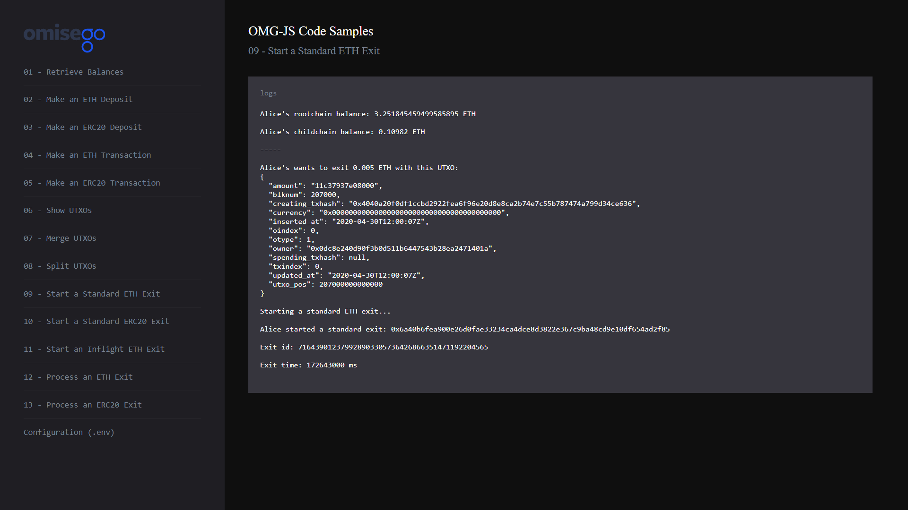

# Start a Standard ETH Exit to the root chain

_By the end of this tutorial you should know how to start a standard Ethereum exit to the root chain._

## Intro

The example uses the `startStandardExit`, `getStandardExitId` functions provided by the `Rootchain` module of the `omg-js` library to start a standard ETH exit from the child chain back to the root chain. In plain terms Exit is a process of withdrawing the funds from the OMG Network. Such terminology follows the original [Plasma concept](https://docs.ethhub.io/ethereum-roadmap/layer-2-scaling/plasma).

## Prerequisites

- At least 1 ETH UTXO in in Alice's OMG Network wallet. For creating a new UTXO, you can [make a deposit](../02-deposit-eth/README.md), [receive a transaction](../03-transaction-eth/README.md), or [split an existing UTXO](../04-utxo-split/README.md).

## Steps

1. App setup
2. Logging root chain and child chain balances for Alice
3. Logging ETH UTXOs for Alice
4. Checking the exit queue
5. Starting a standard exit

### 1. App setup

You can find the full Javascript segment of this tutorial in [exit-standard-eth.js](./exit-standard-eth.js). The first lines define dependent libraries, set up configs for child chain and root chain, define wallet's data for Alice.

```
import Web3 from "web3";
import { ChildChain, RootChain, OmgUtil } from "@omisego/omg-js";
import config from "../../config.js";

const web3 = new Web3(new Web3.providers.HttpProvider(config.eth_node), null, {
  transactionConfirmationBlocks: 1,
});
const rootChain = new RootChain({
  web3,
  plasmaContractAddress: config.plasmaframework_contract_address,
});

const childChain = new ChildChain({
  watcherUrl: config.watcher_url,
  watcherProxyUrl: config.watcher_proxy_url,
  plasmaContractAddress: config.plasmaframework_contract_address,
});

const aliceAddress = config.alice_eth_address;
const alicePrivateKey = config.alice_eth_address_private_key;
```

### 2. Logging root chain and child chain balances for Alice

Logging balances helps to understand the amount of funds available for submitting a standard exit. For performing this operation, use `getBalance` function provided by [web3.js](https://github.com/ethereum/web3.js) to retrieve the balance from the root chain (Ethereum Network), and `getBalance` function provided by [omg-js](https://github.com/omgnetwork/omg-js) to retrieve balance from the child chain (OMG Network). For a more detailed example, please refer to [Retrieve Balances](../01-balances/README.md) sample.

```
async function logBalances() {
  const aliceRootchainBalance = await web3.eth.getBalance(aliceAddress);
  const aliceChildchainBalanceArray = await childChain.getBalance(aliceAddress);
  const alicesEthObject = aliceChildchainBalanceArray.find(
    (i) => i.currency === OmgUtil.transaction.ETH_CURRENCY
  );
  const aliceChildchainETHBalance = alicesEthObject
    ? `${web3.utils.fromWei(String(alicesEthObject.amount))} ETH`
    : "0 ETH";

  console.log(
    `Alice's rootchain balance: ${web3.utils.fromWei(
      String(aliceRootchainBalance),
      "ether"
    )} ETH`
  );
  console.log(`Alice's childchain balance: ${aliceChildchainETHBalance}`);
}
```

Example output:

```
Alice's root chain balance: 3.283270598998171475 ETH

Alice's child chain balance: 0.04719 ETH
```

### 3. Logging ETH UTXOs for Alice

Logging UTXOs helps to understand how many UTXOs you have to submit an exit. For a more detailed example, please refer to [Show UTXOs](../04-utxo-show/README.md) sample.

You can exit only 1 UTXO at a time. Consider [merging multiple UTXOs](../04-utxo-merge/README.md) into 1 UTXO or [splitting UTXO](../04-utxo-split/README.md) if you don't want to exit all of your funds at once with a single UTXO.

By default, the UTXO to exit is the youngest one that was created.

Every exit requires an extra fee called an [exit bond](https://docs.omg.network/exitbonds) as an incentive mechanism for users of the OMG Network to exit honestly and challenge dishonest exits. The bond is currently fixed at an amount estimated to cover the gas cost of submitting a challenge. You can check the current gas cost at [Gastracker](https://etherscan.io/gastracker) provided by the Etherscan.

```
const aliceUtxos = await childChain.getUtxos(aliceAddress);
const aliceUtxoToExit = aliceUtxos.find(
  (i) => i.currency === OmgUtil.transaction.ETH_CURRENCY
);
if (!aliceUtxoToExit) {
  console.log("Alice doesn't have any ETH UTXOs to exit");
  return;
}

console.log(
  `Alice's wants to exit ${web3.utils.fromWei(
    String(aliceUtxoToExit.amount),
    "ether"
  )} ETH with this UTXO:\n${JSON.stringify(aliceUtxoToExit, undefined, 2)}`
);
```

Example output:

```
Alice's wants to exit 0.007 ETH with this UTXO:
{
  "amount": "18de76816d8000",
  "blknum": 124000,
  "creating_txhash": "0x810dc27fe8b79127246775ddc1a323327034ad07640e48aba69f070dd96e613b",
  "currency": "0x0000000000000000000000000000000000000000",
  "inserted_at": "2020-04-17T14:05:13Z",
  "oindex": 0,
  "otype": 1,
  "owner": "0x8b63bb2b829813ece5c2f378d47b2862be271c6c",
  "spending_txhash": null,
  "txindex": 0,
  "updated_at": "2020-04-17T14:05:13Z",
  "utxo_pos": 124000000000000
}
```

### 4. Checking the exit queue

Exits are processed in queues that contain tokens you can use to start an exit. Before you start an exit, the network has to verify that the exit queue for the token used in the UTXO exists. You can check that information with the `hasToken` function provided by the `Rootchain` module of the `omg-js` library.

If the exit queue doesn't have this token, you can add it with `addToken` function provided by the `Rootchain` module of the `omg-js` library.

```
const hasToken = await rootChain.hasToken(OmgUtil.transaction.ETH_CURRENCY);
if (!hasToken) {
  console.log(`Adding a ${OmgUtil.transaction.ETH_CURRENCY} exit queue`);
  await rootChain.addToken({
    token: OmgUtil.transaction.ETH_CURRENCY,
    txOptions: { from: aliceAddress, privateKey: alicePrivateKey },
  });
}
```

### 5. Starting a standard exit

For starting a standard exit, use `startStandardExit` function provided by the `Rootchain` module of the `omg-js` library.

```
// start a standard exit
console.log("Starting a standard ETH exit...");
const exitData = await childChain.getExitData(aliceUtxoToExit);
const standardExitReceipt = await rootChain.startStandardExit({
  utxoPos: exitData.utxo_pos,
  outputTx: exitData.txbytes,
  inclusionProof: exitData.proof,
  txOptions: {
    privateKey: alicePrivateKey,
    from: aliceAddress,
    gas: 6000000,
  },
});
console.log(
  "Alice started a standard exit: " + standardExitReceipt.transactionHash
);

const exitId = await rootChain.getStandardExitId({
  txBytes: exitData.txbytes,
  utxoPos: exitData.utxo_pos,
  isDeposit: aliceUtxoToExit.blknum % 1000 !== 0,
});
console.log("Exit id: " + exitId);

const { msUntilFinalization } = await rootChain.getExitTime({
  exitRequestBlockNumber: standardExitReceipt.blockNumber,
  submissionBlockNumber: aliceUtxoToExit.blknum,
});

console.log("Exit time: " + msUntilFinalization + " ms");
```

Example output:

```
Starting a standard ETH exit...

Alice started a standard exit: 0x29643e26a947f5efd78eb0854151f9942c81acc689fb75b7b4453957f9e2f590

Exit id: 1438997387563518723772889822846363694618122838

Exit time: 86400000 ms
```

## Running the sample

1. Enter the `omg-js` folder if you're in the root `omg-samples` repository:

```
cd omg-js
```

2. Install dependencies:

```
npm install
```

3. Create `.env` file, modify configurations with required values (look at [.env.example](../../.env.example) or [README](../../README.md) of the `omg-js` repo for details).

4. Run the app:

```
npm run start
```

5. Open your browser at [http://localhost:3000](http://localhost:3000).

6. Select `Start a Standard ETH Exit` sample on the left side, observe the logs on the right:


